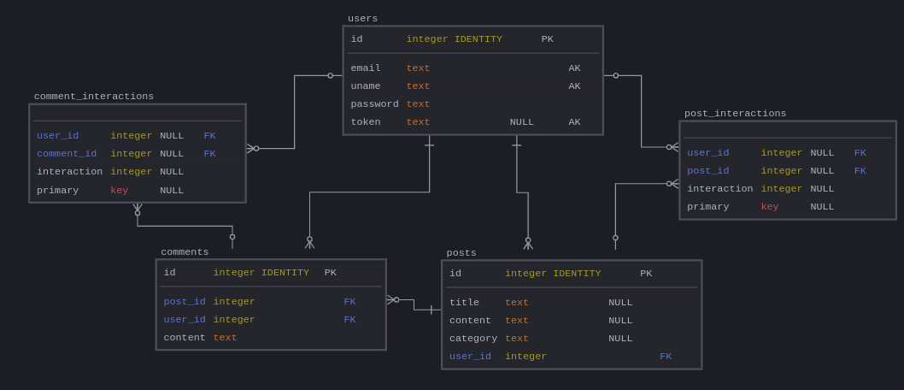

# Forum 

## Project Overview

This project involves building a web forum application using Go, SQLite, and Docker. The forum will allow users to communicate through posts and comments, associate categories with posts, like and dislike content, and filter posts based on various criteria.  This project is designed as an educational exercise to reinforce understanding of web development fundamentals, database management, and containerization.

##

## Project Purpose

The primary goal is to create a functional web forum that demonstrates proficiency in several key areas:

* **Back-end Development (Go):** Implementing the core logic for user authentication, post management, database interaction, and API endpoints.
* **Database Management (SQLite):** Designing and managing a relational database using SQLite to store user data, posts, comments, and likes/dislikes.
* **Front-end Development (HTML):** Creating a basic user interface for interacting with the forum.
* **Containerization (Docker):** Packaging the application and its dependencies into a Docker container for easy deployment and portability.
* **Security:** Implementing basic security measures, including password encryption (bonus task) and session management using cookies.

## Key Features and Implementation Details

This section details the key features of the forum and how they are implemented:

**1. User Authentication:**

*   Users can register with an email, username, and password.
*   Password encryption is a bonus task (using bcrypt).
*   Login sessions are managed using cookies with expiration dates.  UUIDs for session IDs are a bonus task.
*   Email uniqueness is enforced during registration.

**2. Post and Comment Management:**

*   Registered users can create posts and comments.
*   Posts can be categorized.
*   Posts and comments are visible to all users (registered or not).

**3. Likes and Dislikes:**

*   Registered users can like and dislike posts and comments.
*   Like/dislike counts are displayed to all users.

**4. Filtering:**

*   Users can filter posts by category, creation date (for registered users), and likes (for registered users, referring to their own activity).

**5. Database (SQLite):**

*   The project utilizes SQLite for data persistence.
*   The database schema should be designed efficiently, potentially using an Entity-Relationship Diagram (ERD).
*   At least one SELECT, one CREATE, and one INSERT query are required.

**6. Docker:**

*   The application is containerized using Docker.

**7. Error Handling:**

*   Robust error handling is implemented to manage HTTP status codes and technical errors.

**8. Code Quality:**

*   The code adheres to Go best practices.  Unit testing is recommended.

**9. Allowed Packages:**

*   Standard Go packages are allowed.  `sqlite3`, `bcrypt`, and `UUID` packages are specifically mentioned.

**10. Frontend Restrictions:**  No frontend frameworks (React, Angular, Vue, etc.) are allowed.  Plain HTML is used.

## Technology Stack

* **Back-end:** Go
* **Database:** SQLite
* **Containerization:** Docker
* **Front-end:** HTML

## Author Information

This project was developed by the following team members:

* Amine Habchi (ahabchi)
* Reda Achnit (rachnit)
* Mohamed Fri (mfir)
* Zayd Zitan (zzitan)
* Othman Qritel (oqritel)
